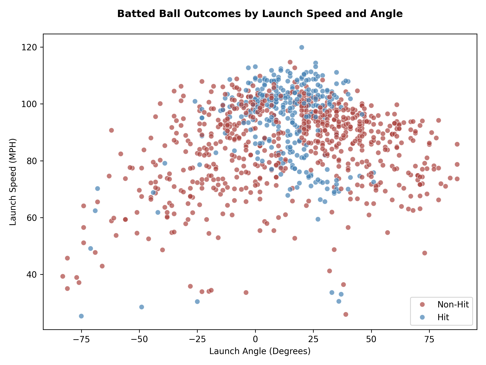
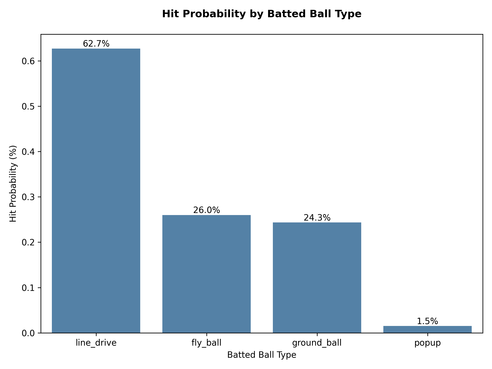
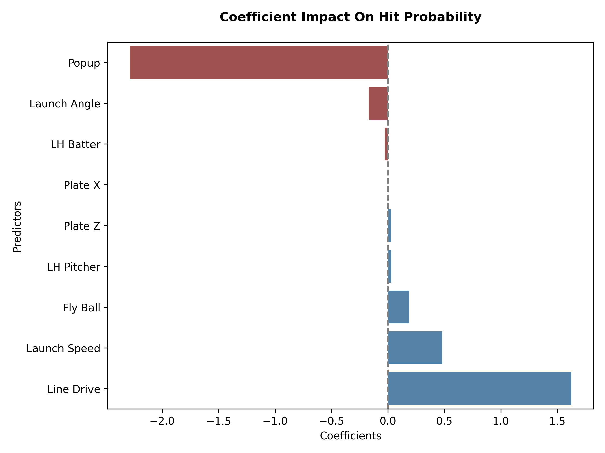
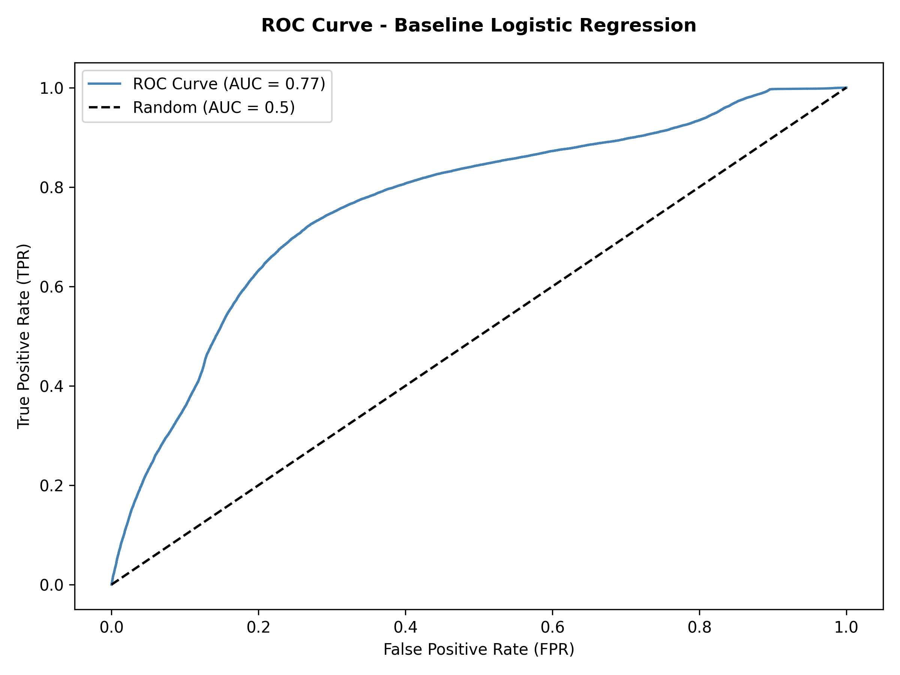

Project Overview
==
**Introduction:** 
This project predicts the probability that a batted-ball event results in a hit using Statcast data available at the moment of contact. Understanding these probabilities helps teams evaluate player performance and identify which metrics drive successful outcomes. 

**Scope:** 
Using MLB Statcast data spanning 5 seasons, I focus on batted-ball characteristics such as launch speed, launch angle, and batted-ball type, along with pitch location and pitcher and batter handedness.

**Approach:** 
I built a baseline logistic regression model to estimate hit probabilities and to assess the contribution of bat-tracking features to predictive performance.

**Takeaways:** 
Results show that contact physics dominate the model's predictive power, while bat-tracking metrics only provide minimal additional value.  

ETL Overview
==
ETL consists of three main scripts:

-`pull_statcast.py`: Pulls raw Statcast data from the MLB API and stores it locally in staging area.

-`load_batted_balls.py`: Loads and cleans raw batted-ball data into the PostgreSQL database.

-`db.py`: Handles database connections and utility functions across the ETL pipeline.

Together, these scripts produce a clean, reproducible slice of data which are fed into QA checks and the predictive modeling pipeline. 

Schema (Table Creation)
==
The schema is implemented in `sql/schema.sql`
- Creates batted_ball_events table, a curated subset of variables related to batted ball events, within PostgreSQL. 
- Each row represents a unique batted ball event
- Not a full mirror of the Statcast schema
- Omits Statcast expected metrics to avoid target leakage

Run this script prior to the ETL script.

Data Quality Assurance (QA)
==
The QA layer is implemented in `sql/qa_check.sql`
- Confirms Statcast batted-ball data is properly ingested and loaded into PostgreSQL.
- Confirms load is complete for 2021-2025 Statcast window by verifying counts by day, month, and year.
- Ensures numeric variables take on plausible ranges and values.
- Verifies labels (is_hit vs. events) are consistent.
- Does not filter season by preseason, regular or postseason.
- Does not restrict observations to model row counts.
- Does not apply modeling feature requirements.

Run this script after full ETL loads and prior to modeling.

Modeling Extract 
==
The extract is incorporated in `sql/modeling_extract.sql`
- Creates a reproducible slice of data for use in predictive modeling where one row represents one batted-ball event.
- Creates the view public.modeling_extract, which serves as the modeling blueprint.
- Filters observations to ensure only domestic regular season games between 2021-2025 are present.
- Omits the variables hc_x, hc_y, and hit_distance_sc as they are captured post-contact.
- Omits the variable zone as it is captured by continuous variables plate_x and plate_z.
- Omits the variable events as it encodes the outcome of each batted-ball event.
- Removes entire row if either launch_speed or launch_angle are null.
- Retains observations with null values in all other columns.
- Does not create train/test splits
- Does not perform feature engineering or transformations.

Run this script after data quality assurance and prior to modeling.

Predictive Model Dataset Retrieval
==
The retrieval of the modeling dataset is handled by `extract.py`
- Retrieves the frozen modeling view from PostgreSQL and enforces modeling dataset requirements.
- Ensures schema parity, required column presence, and target variable validity.
- Does not handle transformations, train/test splits, or feature engineering.

Run after the modeling view has been created and prior to time-based train/test split.

Training and Testing DataFrames
==
Creation of training and testing DataFrames is handled by `split.py`
- Observations on or before December 31, 2024, used to create Training DataFrame.
- Observations on or after January 1, 2025, used to create Testing DataFrame.
- Does not use random sampling to create train/test DataFrames in order to mirror real-world deployment, where models are trained on past seasons and evaluated on future seasons.
- Does not handle transformation or feature engineering.

Run this script after retrieval and validation of the predictive modeling dataset.

Baseline Logistic Regression Model 
==
Creation of the baseline logistic regression model is handled by `baseline_logistic_regression.py`
- Trains logistic regression model using baseline Statcast features plate_x, plate_z, launch_speed, launch_angle, bb_type, stand, and p_throws.
- Uses time-based split where training observations occur between January 1, 2021, and December 31, 2024, and testing observations occur on or after January 1, 2025.
- Applies preprocessing pipelines including imputation, scaling of numeric features, and one-hot encoding for categorical features.
- Uses a fixed threshold of 0.50 for predicted hits.
- Serves as the baseline model for subsequent bat-tracking feature comparison experiments.

Run this script after successful predictive model dataset retrieval and train/test split.

Bat-Tracking Logistic Regression Model
==
Creation of the bat-tracking logistic regression model is handled by `bat_tracking_logistic_regression.py`
- Trains logistic regression model using the same baseline Statcast features with inclusion of bat-tracking features bat_speed, swing_length, attack_direction, attack_angle, swing_path_tilt, intercept_ball_minus_batter_pos_x_inches, and intercept_ball_minus_batter_pos_y_inches.
- Uses time-based split where training observations occur between July 14, 2023, and December 31, 2024, and testing observations occur on or after January 1, 2025.
- Applies preprocessing pipelines including imputation, scaling of numeric features, and one-hot encoding for categorical features.
- Uses a fixed threshold of 0.50 for predicted hits.
- Serves as the bat-tracking model for feature comparison experiments.

Run this script after implementation of the baseline logistic regression model.

A/B Feature Experimental Comparison
==
Feature comparison handled by `baseline_vs_bat_tracking_comparison.py`
- Uses time-based splits to create training and testing DataFrames
- Observations between July 14, 2023, and December 31, 2024 (inclusive) are used to create training DataFrame.
- Observations on or after January 1, 2025, are used to create testing DataFrame.
- Both models receive identical rows by omitting observations with missing values across any features used in the comparison.
- Predicted hits are determined using a fixed threshold of 0.50.
- Does not handle feature engineering, threshold optimization, hyperparameter tuning, or model selection.
- Produces summary table directly comparing models based on predicted hits at fixed threshold using Accuracy, Precision, Recall, Specificity, F1, ROC AUC, and Average Precision.

Run this script after implementing and validating baseline models.

Feature Experiment Summary
==
**Experiment Goal:**  
Determine whether the inclusion of bat-tracking features provides meaningful improvement in estimating hit probability compared to baseline Statcast features when using a logistic regression model with identical preprocessing and modeling pipelines.

**Ranking Performance:**  
Model B produced an ROC AUC value of .766399 compared to model A’s ROC AUC of .766662. Therefore, when it comes to assigning probabilities, if we randomly select a hit and a non-hit, both models will assign a higher probability to the hit than the non-hit roughly 77% of the time. As a result, both models are near identical and discriminate between classes (hit versus non-hit) well. 
Of note, model B produced a higher average precision value of .594423 compared to model A’s .591399. Ultimately, this difference is negligible but conveys model B may have ranked a few hits higher than non-hits compared to model A.

**Threshold Behavior:**  
Model B and model A both shared a fixed threshold of 0.50 with batted ball events being classified as hits whenever predicted probabilities were greater than or equal to 0.50 and classified as non-hits whenever predicted probabilities fell below 0.50. Ultimately, both models were quite conservative with model B producing a predicted hit rate of .207187 compared to model A’s predicted hit rate of .211176. In other words, model B predicted 20.7% of all batted ball events would result in a hit while model A predicted 21.1%, suggesting both models are quite conservative at the 0.50 threshold. Interestingly, model B had a higher precision of .621211 compared to model A’s .618198, yet model A had a recall of .412276 compared to model B’s .406459 showcasing the precision recall tradeoff. Because model B was a tad more selective when predicting hits, it could predict less false positives (non-hit predicted as hit). However, because it is more selective it also doesn’t predict hits as often leading to more false negatives (hit predicted as non-hit) leading to a lower recall rate. 
Furthermore, both models were trained and tested on unbalanced data with respective hit rates of .319 and .317. This imbalance could lead to model accuracy being misleading. To account for this imbalance F1 scores were calculated and again model A edged out model B (.494662 to .491397) confirming the inclusion of bat-tracking metrics led to no meaningful improvement in precision or recall.

**Conclusion:**  
All core evaluation metrics confirm the inclusion of bat-tracking features did not lead to any meaningful improvements in batted ball event hit prediction capabilities. In fact, because the evaluation metrics between the two models were near identical this suggests that the baseline Statcast contact metrics up to the point of contact captured a lot of the same variation captured by bat-tracking metrics. This is sensible because features such as launch_speed and launch_angle are contact dependent. In the causal timeline of events, a hit is preceded by contact and contact is preceded by a swing. Therefore, features which capture swing mechanics will be captured by contact physics. Although predictive capabilities were not improved, it would be wrong to suggest bat-tracking features are useless. Instead, the results suggest this project is not the right instance to utilize bat-tracking metrics but if the future work aimed to predict launch_speed, then I believe bat-tracking features used would shine and be of great use. Ultimately, it can be concluded that bat-tracking features provide no meaningful improvement in estimating hit probabilities.

Results
==
Since bat-tracking features did not meaningfully improve model performance, all results and interpretations will be based on the baseline logistic regression model crafted in `baseline_logistic_regression.py`.   
**What Coefficients Mean:** 
Training a logistic regression model produces an estimated coefficient for each feature used. Each coefficient represents the change in log-odds of a hit associated with a feature, holding all other variables constant.
  
For numeric features, a one-unit change typically represents the change in log-odds for a one-unit change in the feature. However, scaling was applied to each numeric feature prior to fitting the model, transforming them to have a mean of 0 and a standard deviation of 1. As a result, coefficients now represent the change in log-odds for a one standard deviation change in the feature.
  
For categorical features, one-hot encoding was applied prior to modeling. This required selecting a reference category which is then dropped during preprocessing. Coefficients are then produced for the remaining categories within a categorical feature which now represent the change in log-odds relative to the reference category. 

Since coefficients are expressed in log-odds, it is common to exponentiate them to ease interpretation. The exponentiated coefficients represent odds ratios. 
  
**Coefficient Insights:** 
Numeric Features: 
Numeric features can be grouped into two categories: 
-	Contact Physics: `launch_speed`, `launch_angle`
-	Pitch Location: `plate_x`, `	plate_z` 

Among numeric features, launch_speed is the strongest numeric predictor of a hit. 
-	Launch Speed Coefficient: 0.479947
-	Odds Ratio: 1.615989

Therefore, a one standard deviation increase in launch speed will increase the odds of a hit by about 62%.  

For context, prior to scaling the training standard deviation for launch speed was 14.97 mph. Meaning this effect corresponds to a significant increase in exit velocity.
This result aligns with baseball intuition as a harder hit ball reduces defensive reaction time, limiting an opposing team's ability to record an out. 

This relationship between launch speed and launch angles, and hit outcomes is illustrated below.

Categorical Features: 
Categorical features can be grouped into two categories:

- Handedness:`stand`, `p_throws`
- Batted-ball type: `bb_type`

Reference categories were set to right-handed batter, right-handed pitcher, and ground ball.

Handedness features offered little insight with coefficients near zero, indicating handedness has little effect on the odds of a hit relative to their reference category. Similar to bat-tracking metrics, this effect is likely absorbed by contact physics (launch speed and launch angle), which more directly determine batted ball outcomes at contact.

In contrast, batted-ball type produced the strongest categorical effects in the model. 

Line Drive 
-	Coefficient: 1.626879
-	Odds Ratio: 5.087972

Line drives increase hit odds by more than 5x compared to ground balls. 

Fly Ball 
-	Coefficient: 0.187963
-	Odds Ratio: 1.206789

Fly balls increase the odds of a hit by roughly 20% compared to a ground ball. 

Popup 
-	Coefficient: -2.286169
-	Odds Ratio: 0.101655

Popups significantly reduce the odds of a hit by nearly 90% compared to ground balls.

The differences in hit probability across batted-ball types are shown below.

These results all align with baseball intuition. A line drive is a batted ball with optimal launch_speed and launch_angle (hard-hit with low trajectory) making them difficult to field. Meanwhile, a popup is the result of a batted-ball being sent nearly 90 degrees straight up giving fielders ample time to position themselves and secure an out. 

Overall, launch speed and batted-ball type account for most of the model's predictive power.

The relative impact and direction of model coefficients for features are summarized below.

**Model Performance** 
Model performance is summarized by the ROC curve below.

Limitations
==
- Logistic regression was chosen for interpretability rather than to maximize predictive performance.
- Batted-ball type is a derived feature based on launch speed and launch angle, which some may argue is technically post-contact.
- Complex nonlinear interactions and higher order terms were not modeled in order to maintain interpretability.

Future Work
==
- Explore more complex models such as gradient boosting and support vector machines to capture nonlinear interactions.
- Incorporate defensive positioning prior to pitch.
- Account for ballpark factors on hit probability.

